# UNLOAD-by-newbie 
Team: Derrick Lee Jia Qian, Chew Zhi Foong, Koh Hui Yuan, Low Zhan Hui

Problem Statement: Stress & Workload Manager

Video Presentation: [https://youtu.be/6L4_blctlmo] 

Presentation Slides: [https://canva.link/inix6w863ggz0k9]

# 1.0 Project Overview
Problem 1: Invisible Cumulative Workload
Students manage academics, work, social commitments and daily responsibilities across different platforms, making their total workload difficult to see.

Problem 2: Planning Creates Additional Cognitive Load
Students often have to manually enter, organise and prioritise their tasks, which can become another burden when they are already overwhelmed.

Problem 3: Existing Tools Show the Problem but Don’t Resolve It
Productivity tools can show deadlines and busy schedules, but they often leave students to decide what should be postponed, dropped or prioritised.

Problem 4: Recovery Is Sacrificed During Overload
When workload increases, students often sacrifice sleep, exercise and social recovery because existing planners prioritise tasks and deadlines rather than wellbeing.

## Existing Apps
Existing productivity apps such as Google Calendar and Notion help students organise schedules and tasks. However, they mainly provide tools for recording, displaying and managing information, rather than automatically analysing the student's overall workload and helping them rebalance it.

## Our Solution
**UNLOAD is an AI-powered workload management app that helps students understand, manage and reduce their overall workload with minimal effort.** Instead of requiring students to manually plan and organise everything, they can simply dump their tasks, schedules and commitments. UNLOAD then analyses their workload, identifies overload and actively helps them rebalance their time while protecting recovery.

## Problem → Solution

### Problem 1 — Invisible Cumulative Workload → AI Workload Analysis
UNLOAD combines academic tasks, work, social commitments and daily activities into one overall workload view, allowing students to see when their total workload becomes excessive.

### Problem 2 — Planning Creates Additional Cognitive Load → Minimal Input Brain Dump + Automatic Capacity Engine
Students can simply dump their tasks and commitments without manually organising everything. UNLOAD analyses the input and determines whether the workload is realistic based on the student's available capacity.

### Problem 3 — Existing Tools Show the Problem but Don’t Resolve It → Adaptive AI Prioritization + Proactive Load Rebalancing
Instead of simply displaying a busy schedule, UNLOAD determines what should be prioritised, postponed, reduced or moved. The AI also learns from the user's preferences and previous decisions, allowing prioritisation to become more personalised over time.

### Problem 4 — Recovery Is Sacrificed During Overload → Guarded Recovery + AI Scheduling
UNLOAD automatically restructures the student's schedule while protecting sleep, exercise, rest and social time, rather than filling every available hour with tasks.

## Key Features
* Minimal Input Brain Dump — Minimal-input task and commitment entry
* AI Workload Analysis — Understands the student's overall workload
* Automatic Capacity Engine — Detects workload beyond realistic capacity
* AI Prioritisation — Identifies what needs attention first
* AI Scheduling — Creates a manageable schedule automatically
* Adaptive AI Personalisation — Learns the user's preferences, priorities and past decisions to continuously fine-tune workload analysis, prioritisation and scheduling. 
* Proactive Load Rebalancing — Moves, reduces or postpones workload
* Guarded Recovery — Protects sleep, exercise, rest and social time
* Actionable Recommendations — Provides clear actions instead of just showing a workload score

# 2.0 Ideation & Process
## 2.1 Ideas We Considered
| Idea | Why it was dropped / kept |
| :--- | :--- |
| **Minimal Input - Brain Dump:** Users enter tasks and commitments using minimal information. **(Chosen)** | Kept as the core feature because it reduces the effort required to organise tasks. Mentors also agreed that minimal input helps keep the application simple and user-friendly. |
| **Minimal Input - Voice:** Users speak naturally about their tasks and commitments, and AI extracts the relevant information. **(Chosen)** | Kept because users can describe their workload naturally without manually filling in multiple fields. |
| **Minimal Input – Image Upload:** Users upload screenshots or photos of timetables, assignment details or work schedules, and AI extracts the relevant information. **(Chosen)** | Kept because it further reduces manual data entry and allows existing schedules or information to be added quickly. |
| **Minimal Input – Google Calendar Import:** Users import existing calendar events and commitments from their Google Calendar into UNLOAD. **(Chosen)** | Kept because it reduces manual data entry by importing existing tasks and commitments from the user’s Google Calendar. |
| **Minimal Input – Automatic LMS Import:** Automatically imports assignments, quizzes and deadlines from university learning platforms. **(Dropped)** | Dropped because integration with different university platforms would increase development complexity and may not be practical for all users. |
| **“Here’s What I Understand” Review:** Displays the information that UNLOAD has interpreted from the user's input, such as tasks, deadlines, commitments and preferences.  **(Chosen)** | Kept because it allows users to verify and correct the AI's understanding before the information is used for workload analysis and scheduling. |
| **Adaptive AI Personalisation:** Learn from user’s preferences and previous decisions to improve future workload analysis, prioritisation and scheduling. **(Chosen)** | Kept because it makes UNLOAD more personalised by adapting recommendations based on how each user manages their workload. |
| **Automatic Capacity Engine:** Detects when a user's workload exceeds their realistic capacity. **(Chosen)** | Kept as one of the main AI capabilities because it helps identify overload and allows the application to assist users before they become overwhelmed. |
| **Spider Chart - Workload Breakdown:** Visually displays workload factors such as time, mental strain, recovery, social and physical activities. **(Chosen)** | Kept because it provides users with a quick visual overview of the different factors contributing to their workload. | 
| **How to Determine Overload – Rule-Based Heuristics:** Determines overload using factors such as time conflicts, cognitive strain and recovery deficit instead of an exact percentage. **(Chosen)** | Kept because calculating an accurate capacity percentage is difficult. Rule-based qualitative indicators are simpler and easier for users to understand. |
| **Automatic Capacity Engine – Percentage:** Uses a percentage to represent the user's workload capacity. **(Dropped)** | Dropped because developing a reliable heuristic for an exact capacity percentage is difficult. The system instead uses qualitative rules and severity levels. |
| **AI Prioritisation:** Automatically determines which tasks should be prioritised. **(Chosen)** | Kept because users should not need to manually decide the priority of every task when they are already overloaded. |
| **AI Scheduling:** Automatically creates a manageable schedule based on tasks, deadlines and available time. **(Chosen)** | Kept because it reduces the effort required to manually plan and organise tasks. |
| **Proactive load rebalancing:** Suggests moving, postponing or reducing tasks when the user's workload becomes too heavy. **(Chosen)** | Kept because the application should not only detect overload but also provide actionable solutions to reduce it. | 
| **Guarded Recovery:** Protects important recovery periods such as sleep, rest, exercise and social time when creating schedules. **(Chosen)** | Kept because the application should consider the user's wellbeing instead of focusing only on completing tasks. |
| **Shared Unload:** Allows classmates to share assignment deadlines and upcoming exams with a friend or group. **(Chosen)** | Kept as an additional feature for minimal input, allowing users to help others update schedules. |

## 2.2 Ideation Boards
Canva (mindmap / system workflow / user flow): [https://canva.link/3hibskcmsmipbse]

### **1. Problem Statement & Proposed Solution**
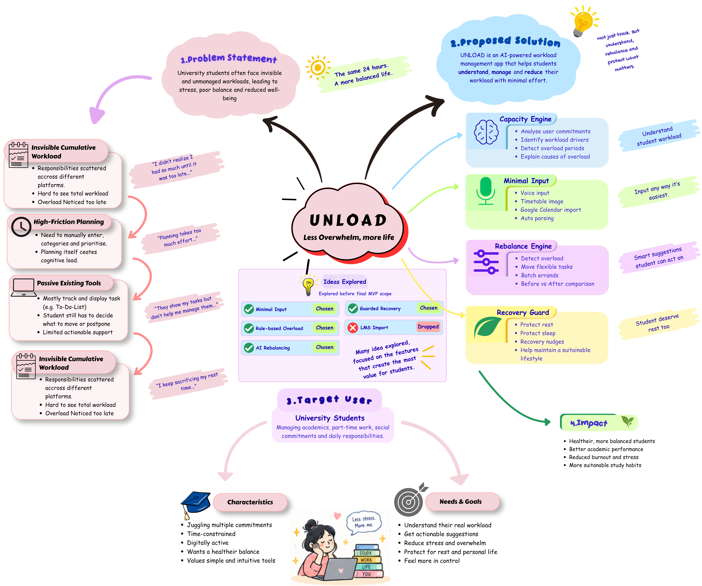

This mindmap summarises the key problems faced by university students, the target users, and how UNLOAD addresses these problems through its proposed features and expected impact. 

### **2. System Workflow**
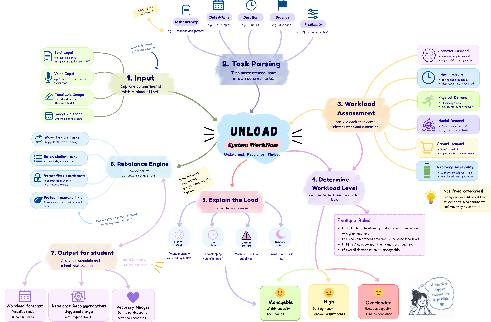 

This diagram shows how UNLOAD processes user commitments, assesses workload across dynamic workload dimensions, determines workload level, explains the causes, and provides actionable rebalancing and recovery recommendations.

### **3. User Flow**
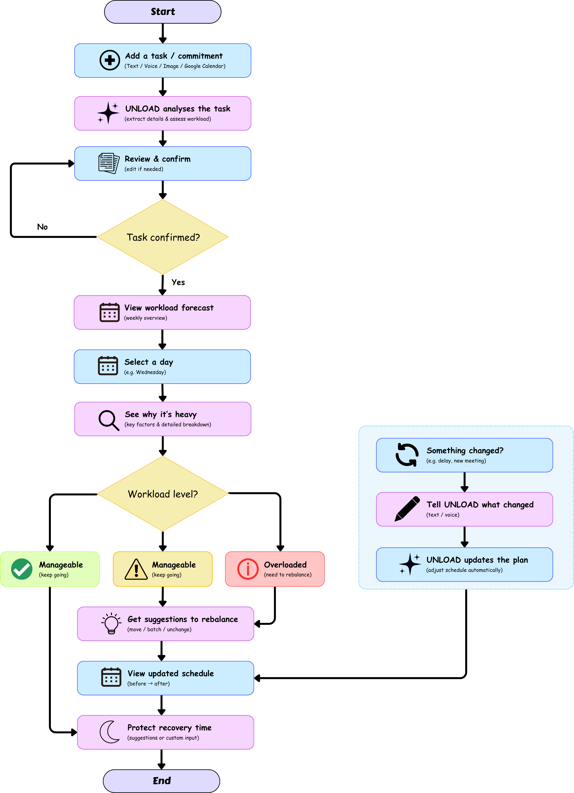

This user flow illustrates the main MVP journey from adding a task or commitment, reviewing UNLOAD's interpretation, viewing the workload forecast, understanding workload causes, and receiving rebalancing recommendations.

## 2.3 Mentor Consultation
### First Mentor Consultation
| Date | Mentor | Feedback Received | What Was Changed |
| :--- | :--- | :--- | :--- |
| 7 Sep 2026 | Zach Khong | **Core Focus:** Make Minimal Input the primary MVP differentiator. | **Core Architecture:** Positioned Minimal Input (Voice, Image, Google Calendar Sync) as the Core Feature. |
||| **No Edit Buttons:** Remove edit buttons for each task, handle all adjustments in a text/voice box. | **Interaction Flow:** Replaced edit buttons with an "Unload Text Box" for schedule adjustments. |
||| **Clarification Prompt:** Add "Anything I missed or got wrong?" to the Review page. | **Review Clarification:** "Anything I missed or got wrong?" with natural language / voice input. |
||| **Dynamic Categories:** Move away from fixed categories; allow multi-dimensional tagging per task (e.g., Work Shift = Time + Mental + Social). | **Dynamic Workload Matrix:** Shifted to automated multi-tag scoring across Mental, Time, Physical, and Social dimensions. |
||| **Remove Percentages:** Drop raw percentage scores (hard to justify heuristics). | **Qualitative Overload Engine:** Replaced percentages with a 3-Tier Severity System (Light, Heavy, Overloaded) driven by rule-based heuristics (Time Collisions, Cognitive Stacking, and Recovery Deficits). |
||| **Accessible Rebalancing:** Make the Rebalance Button sticky/immediately visible without scrolling. | **Sticky Rebalance Button:** Positioned the Rebalance button directly above the bottom navigation bar for instant access. |
||| **Flexible Recovery:** Make recovery suggestions optional and non-prescriptive (e.g., valid recovery includes simply "doing nothing" or skipping). | **Flexible Guarded Recovery:** Redesigned recovery into flexible options (Rest, Gaming, Walk), as well as allowing to skip the selection. |
||| **Expanded Input:** Explore more minimal input methods like passive background syncing (Google Calendar, LMS). | **Google Calendar Import:** Google Calendar Import is added to automatically sync existing calendar events and commitments from users’ Google Calendar |
||| **Stronger Reasoning:** Formulate a stronger problem statement to highlight why the app is uniquely useful. | **Refined Problem Statement:** Framed UNLOAD as a solution to Cognitive Planning Fatigue—eliminating setup friction while solving Invisible Cumulative Load. |
||| **Feature Deferral:** Hold proposed friend/group dump features and focus purely on minimal input for the core MVP. | **Future Enhancements List:** Moved Friend / Group Dump collaborative features to the post-MVP roadmap. |

### Second Mentor Consultation
| Date | Mentor | Feedback Received | What Was Changed |
| :--- | :--- | :--- | :--- |
| 9 Sep 2026 | Khor Jia Quan (Stefan) | **Visual Clarity:** Make input areas more visually obvious so students can immediately identify where they need to enter information. | **Input Visibility:** Increased the contrast of input/fill-in areas so students can immediately recognise where they should provide information. |
||| **Before/After Screen:** Show how the screen is input by the user before and after in the prototype to clearly demonstrate the core Minimal Input module. | **Before/After Main Screen:** Added a before-and-after presentation on Screen 1 to demonstrate the Minimal Input experience and its resulting changes. |
||| **Task Numbering:** Add numbering to make individual tasks easier to identify and reference. | **Task Numbering:** Added index numbers to the task list on Screen 2 so individual tasks are easier to identify and reference. |
||| **Numbering Visibility:** Improve the contrast of task numbering so it is clearly visible against the background. | **Numbering Contrast:** Improved the colour contrast of the task numbers on Screen 3 to make them more noticeable. |
||| **Action Accessibility:** Keep the change-plan action easily accessible at the top of the screen rather than requiring students to scroll. | **Change-Plan Placement:** Moved the change-plan interaction to the top of the relevant screen so the primary action is immediately accessible. |
||| **Workload Visualization:** Move the radar/spider chart higher on the screen so students can understand the overall workload before reading the detailed breakdown. | **Radar Chart Placement:** Moved the radar/spider chart to the top of the workload analysis screen to provide an immediate visual overview. |
||| **AI Communication:** Replace the generic “What Changes” wording with “AI Suggestion” to make it clearer that the recommendation comes from UNLOAD's AI. | **AI Suggestion:** Changed “What Changes” to “AI Suggestion” to clearly communicate the purpose and source of the recommendation. |
||| **Schedule Interaction:** Add a dedicated schedule UI to demonstrate how the AI-generated changes affect the student's actual schedule. | **Schedule Screen:** Added a dedicated Schedule screen showing the student's timeline, fixed events, flexible tasks, and the result of AI-based schedule changes. |
||| **Notification Output:** Add notification feedback to show students when a schedule/task change has been made. | **Notification Output:** Added notification UI to demonstrate how UNLOAD informs students about upcoming tasks and schedule changes. |
||| **Main UX Focus:** Prioritize simplicity and ease of use for students, with greater emphasis on UX rather than adding unnecessary features. | **UX Simplification:** Refined the interface to reduce unnecessary interactions and keep the main experience focused on Minimal Input and AI Suggestions. |

### Third Mentor Consultation
| Date | Mentor | Feedback Received | What Was Changed |
| :--- | :--- | :--- | :--- |
| 12 Sep 2026 | Zach Khong | **Global Mic Button Assessment:** Suggested replacing the central + (Add Commitment) Floating Action Button with a global mic button to reduce clicks for schedule changes, but concluded keeping the dedicated Add Commitment route is functional as-is. | **Maintained Core Add Flow:** Retained the central + Floating Action Button for structured commitment entry while keeping quick voice/text changes available in the schedule view. 
||| **Tab Realignment:** Recommended replacing the low-utility Profile tab with a more valuable feature, such as the Friends/Shared feature. | **Replaced Profile Tab:** Swapped the static Profile tab in the bottom navigation with a dedicated Shared Tab housing passive friend pings and shared course dumps.    **Relocated Profile Access:** Moved the Profile access point to an icon button on the Today / Daily Page header (top-right) so user settings remain easily accessible without wasting primary tab space. |

# 3.0 Design & Prototype
UI Prototype: [https://www.figma.com/design/bnRrqAsERvT5XnxFvYBQwZ/UNLOAD-prototype]

The UNLOAD prototype demonstrates the complete core workflow from minimal-input workload capture to workload analysis, rebalancing and recovery. The following screens highlight the main interactions and design decisions.

### Screen 1: Minimal Input / Brain Dump
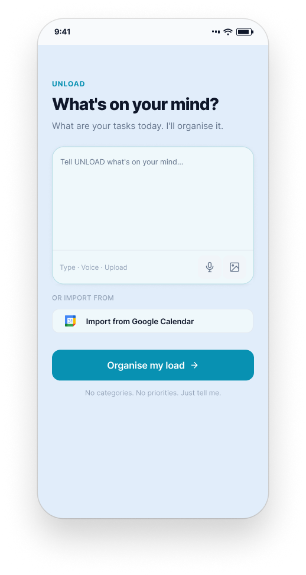

**Description:**
Students can quickly unload their commitments through text, voice or image input without manually filling in multiple task fields. This reduces planning effort at the point where students may already feel overwhelmed.

### Screen 2: “Here’s What I Understand”
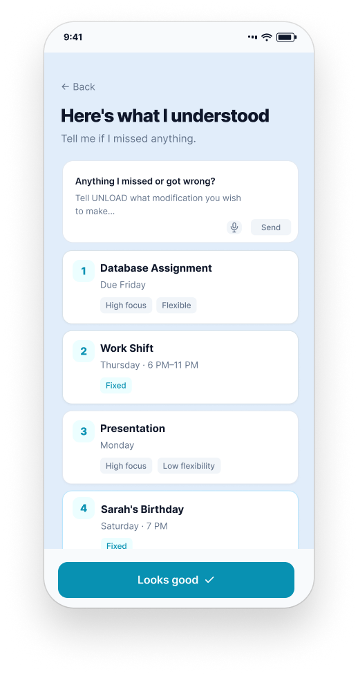

**Description:**
UNLOAD converts the student's unstructured input into structured commitments. Instead of editing individual fields, users can simply respond through the “Anything I missed or got wrong?” input if clarification is needed.

### Screen 3: Today’s Workload
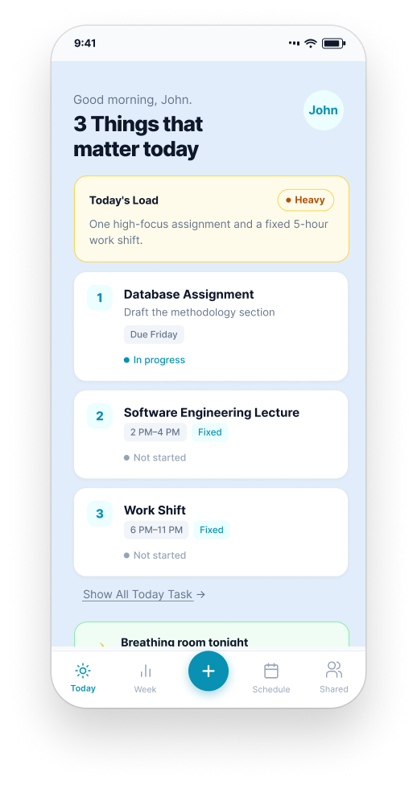

**Description:**
The Today view summarises the student's current workload and highlights important commitments without requiring them to manually calculate their workload.

### Screen 4: Why Is Today Heavy?
|||
| :--- | :--- |
| 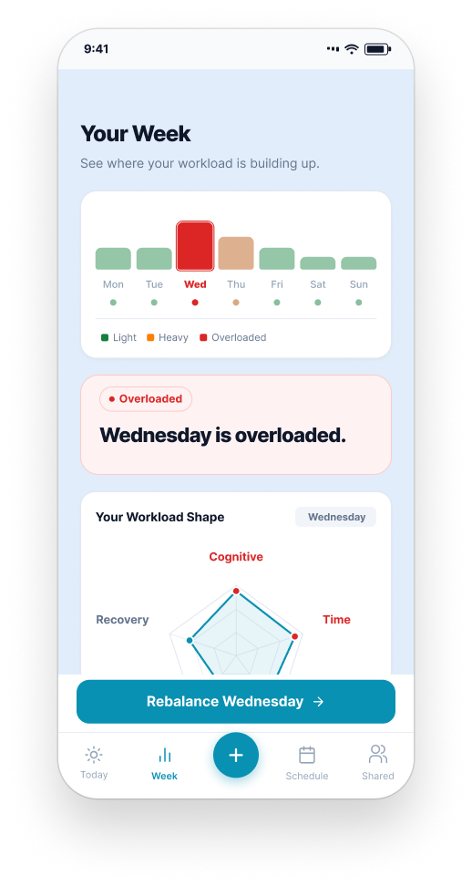 | 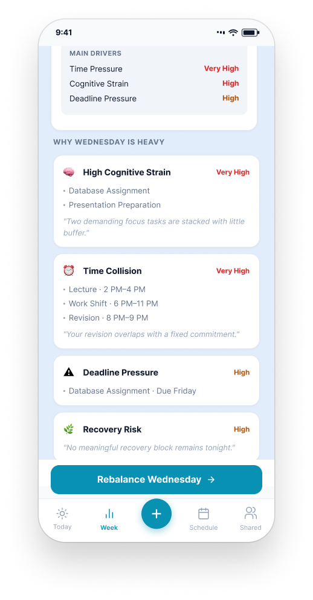 |

**Description:**
UNLOAD explains the factors contributing to workload pressure, such as cognitive strain, time collisions, deadline pressure and limited recovery, rather than presenting only a workload score.

### Screen 5: AI Suggestion / Rebalance
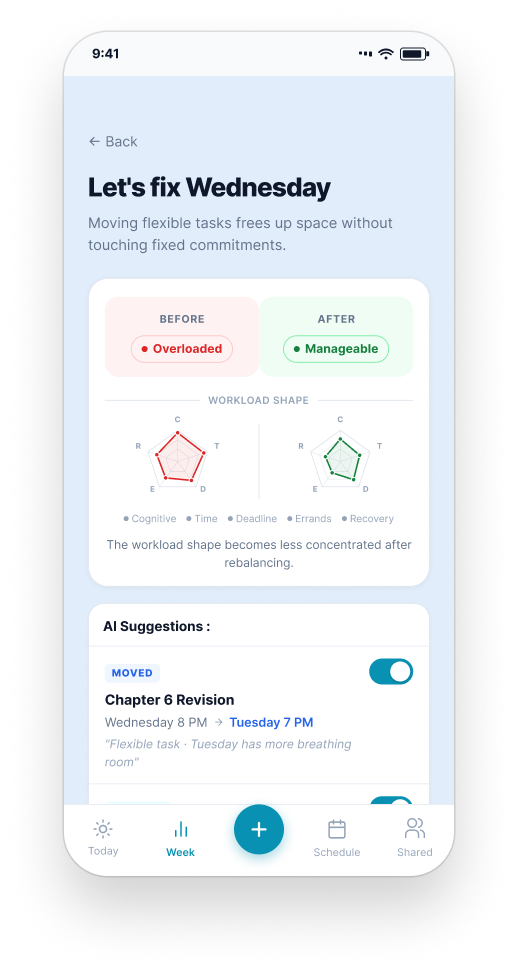

**Description:**
UNLOAD identifies flexible commitments that can be moved or adjusted and presents a Before vs. After plan so students can see how the suggested change reduces workload pressure.

### Screen 6: Schedule
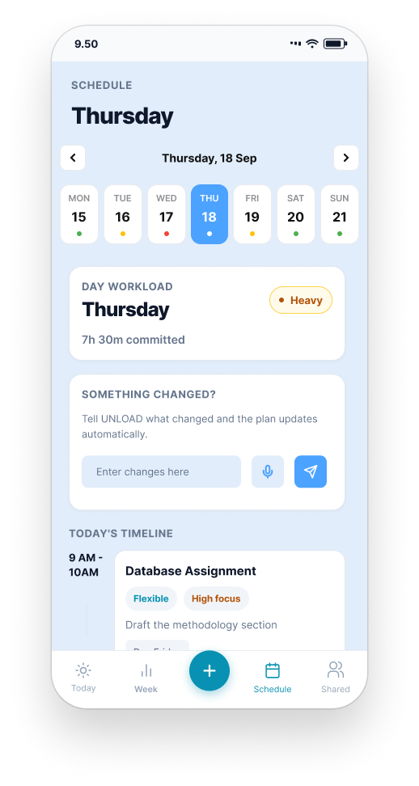

**Description:**
The Schedule view shows fixed commitments and flexible tasks together, allowing students to see how the recommended changes affect their actual timetable.

### Screen 7: Guarded Recovery
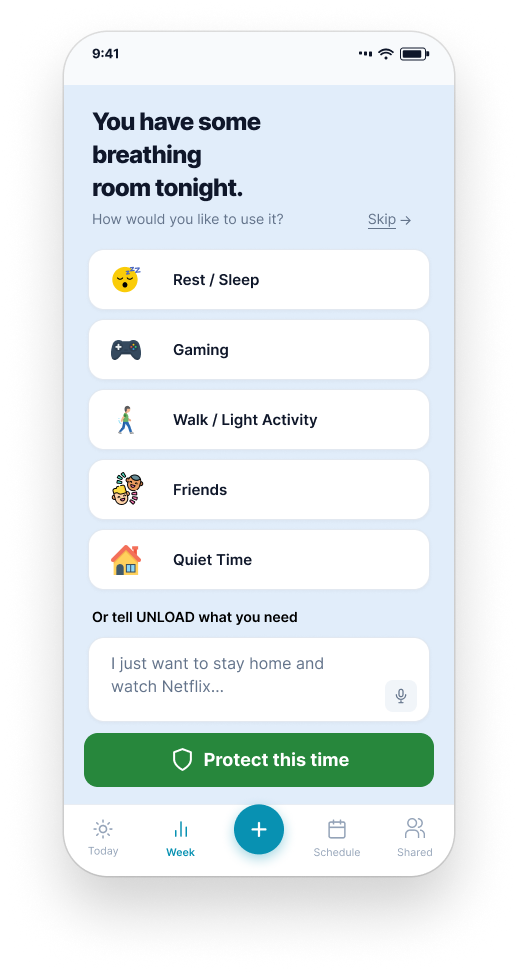

**Description:**
After reducing workload pressure, UNLOAD protects space for recovery. Students can choose activities such as rest, gaming, walking or simply doing nothing.

### Screen 8: Shared
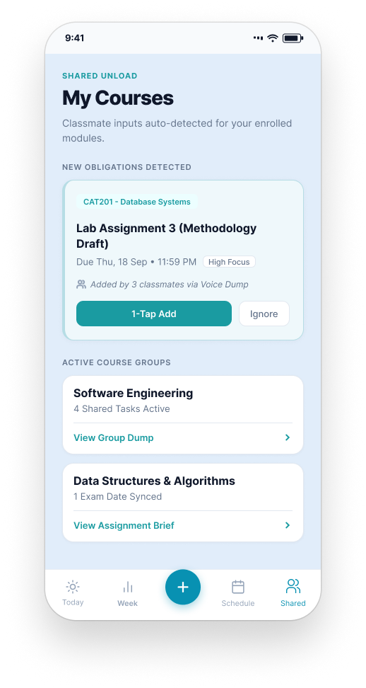

**Description:**
The Shared tab provides a supporting feature where classmates can share course commitments that students can quickly add to their own workload.

# 4.0 What Makes It Different
UNLOAD shifts the productivity paradigm from **High-Input, Passive-Reporting** to **Zero-Friction Intake, Proactive Resolution.** While traditional tools record what you type, UNLOAD actively unburdens the student.

## Novel Features & Their Original Twists
1. Multi-Modal "Voice Unload" Intake (Original Concept)
* **The Twist:** Traditional apps require structured form inputs (titles, dates, priority tags, color coding). UNLOAD allows students to dump messy thoughts via natural voice inputs, images such as schedule screenshots, or text dumps in under 15 seconds. There is also "Anything I missed?" single-textbox review, which allows users to make corrections to the AI’s analysis and decisions.
  
2. Multi-Dimensional Dynamic Workload Matrix
* **The Twist:** Existing tools measure workload purely in hours spent. UNLOAD evaluates tasks across dynamic, non-isolated dimensions—combining Mental Effort, Physical Fatigue, Time Collisions, and Social Strain (e.g., tagging a retail shift as Time + Physical + Social strain).
  
3. Qualitative Heuristic Overload Engine 
* **The Twist:** Instead of only measuring and displaying workload purely in hours spent, UNLOAD uses a rule-based 3-Tier Severity Matrix (🟢 Light, 🟠 Heavy, 🔴 Overloaded) triggered by Time Collisions, Cognitive Stacking (>2 heavy tasks/day), and Recovery Deficits. It then explicitly answers: "Why is today heavy?"

4. Proactive Load Rebalancing 
* **The Twist:** Standard calendars show red deadline overlaps but leave it to students to manually reschedule everything. UNLOAD acts as an automated constraint solver, presenting a **Before vs. After** rebalance plan that moves, batches, or defers flexible tasks with a single tap.

5. Guarded Recovery
* **The Twist:** Traditional tools treat empty calendar slots as "free time" to pack more tasks. UNLOAD locks in rest, sleep, and social downtime as non-negotiable constraints. If a student is severely burnt out, the app explicitly supports **"Doing Nothing"** as a valid, protected recovery option.

### Comparison with Existing Solutions
| Feature Dimension | Traditional Tools (Google Calendar, Notion, Todoist) | UNLOAD (Our Solution) |
| :--- | :--- | :--- |
| **Input Friction** | **High:** Manual typing, date selection, tagging, and continuous maintenance. | **Zero/Minimal:** Voice, image, and single-prompt adjustments. |
| **Workload View** | **Fragmented:** Academic deadlines, work rosters, and social plans live in separate app silos. | **Unified Cumulative Load:** Analyzes total life strain across Mental, Physical, Time, Errands, and Recovery. |
| **Overload Management** | **Passive Alerting:** Shows a crowded, stressful schedule but leaves decision-making to the user. | **Proactive 1-Tap Rebalancing:** Automatically calculates and applies optimal schedule shifts. |
| **Treatment of Rest** | **Sacrificed First:** Rest is ignored or treated as soft, fillable space. | **Guarded Constraint:** Rest is protected as a core requirement for sustainable output. |
| **User Interaction Model** | **High Cognitive Effort:** Feels like taking an extra administrative class. | **Action-First Assistant:** Converts raw workload data into immediate, low-friction actions. |

# 5.0 Technical Architecture & Feasibility
## 5.1 Tech Stack Selection & Justifications
| Component | Technology | Why We Chose It | Constraints & Risk Mitigation |
| :--- | :--- | :--- | :--- |
| **Frontend Mobile App** | **Kotlin / Jetpack Compose** | Native Android performance, modern declarative UI building, and seamless integration with Material 3 UI components and lock-screen widgets. | iOS is excluded for the hackathon phase to ensure hyper-focused MVP delivery. |
| **Backend & APIs** | **Node.js (TypeScript) / Express** | Lightweight, event-driven runtime ideal for fast JSON handling, text parsing workflows, and external API integrations. | Cold starts if hosted on free serverless tiers; mitigated by using lightweight containers or keep-alive pings. |
| **Database** | **Firebase Firestore + Room Database** | Local-first Room database for fast offline access on device, synced seamlessly with cloud Firestore for user state backup. | Real-time listeners can increase read operations; managed by caching daily schedules locally in Room. |
| **Authentication** | **Firebase Auth (Google OAuth)** | 1-tap sign-in with Google reduces onboarding friction to under 5 seconds for university students. | Scope permissions for Google Calendar sync require explicit user consent flows. |
| **Voice & OCR Intake** | **Whisper API / Google Cloud Vision** | Whisper provides industry-leading accuracy for multi-accented, messy speech parsing; Vision API handles image-to-text for timetables. | Processing audio/images adds 1–2 seconds of latency; mitigated by showing optimistic UI states (e.g., Screen 02 loading animation). |
| **AI Workload Parsing** | **Gemini API (LLM Layer)** | Flexible zero-shot extraction of structured task properties (title, date, estimated duration, cognitive strain) from raw text/voice. | Token usage limits and API latency; managed by strict JSON schema outputs and fallback rule-based Regex parsing. |
| **Push Notifications** | **Firebase Cloud Messaging (FCM)** | Reliable cross-platform push infrastructure for proactive recovery alerts and schedule check-ins. | Users can turn off notifications; mitigated by placing recovery alerts directly inside the main app dashboard. |
| **Hosting & Deployment** | **Google Cloud Run** |  Fully managed, scalable container platform with generous free-tier hosting for backend services. | Free tiers sleep after inactivity; configured health check endpoints to maintain responsiveness. |

## 5.2 Build Plan & MVP Scope 
To ensure high feasibility within the limited building phase, non-essential features are explicitly scoped out.

### In-Scope (What We WILL Build for MVP)
1. Core Minimal Input Intake
* Audio Voice Dump (Speech-to-Text →  Task Parsing).
* Text Unload Box ("What's on your mind?" input bar).
* Parser Review Screen (Screen 02 with "Anything I missed or got wrong?" prompt).

2. Qualitative Overload Engine
* 3-Tier Severity Indicators (🟢 Light, 🟡 Heavy, 🔴 Overloaded) using Heuristic rules.
* "Why today is heavy" qualitative breakdown (No raw percentages).

3. 1-Tap Rebalancing
* Sticky Rebalance action card proposing task deferrals/batching.

4. Core UI & Screen Flow
* Unload Input Screen →  AI Analysis Review Screen → Today's Focus Screen →  Daily Schedule Screen.

5. Optional Guarded Recovery
* Personalised downtime suggestions (Rest, Walk, Gaming, or Skip/Zero-activity).
  
**Out-of-Scope (Deferred to Future Roadmap)**
* Automatic live GPS/traffic tracking and auto-rescheduling during jammed commutes.
* Deep two-way Google Calendar / Canvas LMS auto-import API background sync.
* Real-time active execution check-in notifications.

## 5.3 Build Timeline & Team Allocation
The MVP will be developed in a three-week build phase, with development prioritised around the core Minimal Input → Workload Analysis → Rebalancing workflow. Non-essential integrations and advanced personalisation will remain outside the MVP to maintain a realistic development scope.

| Phase | Main Tasks | Expected Output |
| :--- | :--- | :--- | 
| **Week 1 – Input & AI Understanding** | Build the Minimal Input interface, text/voice input, basic image/OCR intake, backend API connection, and AI task parsing. | Working brain-dump input and “Here’s What I Understand” review flow. |
| **Week 2 – Workload Analysis** | Implement task data processing, workload dimensions, rule-based severity detection, and “Why is today heavy?” analysis. | Working Light / Heavy / Overloaded workload analysis. |
| **Week 3 – Rebalancing & Recovery** | Implement schedule changes, rebalancing suggestions, recovery protection, Shared tab integration, testing and deployment. | End-to-end MVP prototype with working core workflow. |

### Team Responsibilities
| Area | Responsibility |
| :--- | :--- |
| **Mobile UI & UX** | Jetpack Compose screens, navigation, interaction flow and visual implementation |
| **Backend & Database** | API development, Firestore/Room data handling and workload data processing |
| **AI & Processing** | AI prompt design, structured task extraction, voice/OCR processing and workload explanation |
| **Integration & Testing** | API integration, notification flow, testing, debugging and deployment |

## 5.4 Resource, Cost & Technical Constraints
UNLOAD is designed to be achievable within a small student hackathon team by prioritising a focused Android MVP and using managed cloud services rather than building infrastructure from scratch.

| Resource | Consideration | Mitigation |
| :--- | :--- | :--- |
| **Development Time** | The main constraint is the limited three-week build period. | Prioritise the Minimal Input → Analysis → Rebalance workflow and defer non-essential integrations. |
| **Team Size** | Development is carried out by a four-person team, requiring parallel work across UI, backend, AI and testing. | Divide development responsibilities by technical area and integrate components progressively. |
| **AI/API Usage** | Gemini, Whisper and Vision API calls may introduce latency or usage limits. | Use structured JSON outputs, limit unnecessary API calls and provide rule-based fallbacks where appropriate. |
| **Cloud Infrastructure** | Firestore and backend hosting may introduce usage limits or costs at higher usage levels. | Keep the MVP small and use available free tiers/credits where applicable. |
| **Device Platform** | Supporting both Android and iOS would increase development effort. | Limit the hackathon MVP to Android using Kotlin and Jetpack Compose. |
| **Advanced Integrations** | Full LMS and background calendar synchronisation require additional authentication and API work. | Keep these integrations outside the core MVP and use simplified/import-based functionality where necessary. |
